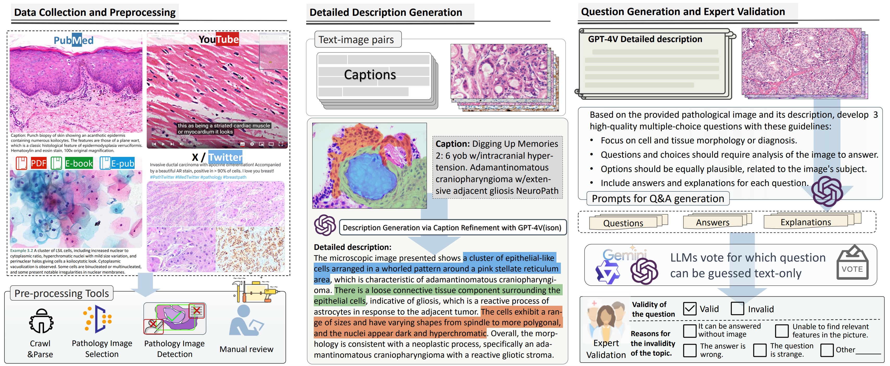
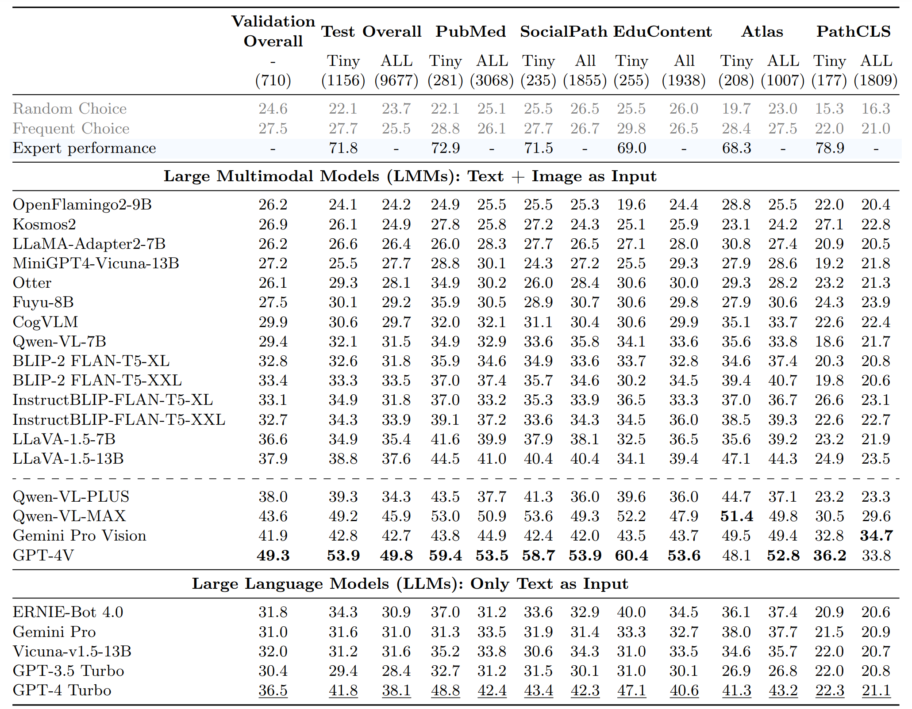

#  PathMMU

This is the official repo for [**PathMMU: A Massive Multimodal Expert-Level Benchmark for Understanding and Reasoning in Pathology**](https://arxiv.org/abs/2401.16355) 

[**🌐 Homepage**](https://pathmmu-benchmark.github.io/) | [**🤗 Dataset**](https://huggingface.co/datasets/jamessyx/PathMMU/) | [**📖 arXiv**](https://arxiv.org/abs/2401.16355) | [**GitHub**](https://github.com/PathMMU-Benchmark/PathMMU)

## 🔔News

- **Important Notes!!!!!!** 
- The benchmark data and evaluation code have been released (8/7/2024)

The emergence of large multimodal models has unlocked remarkable potential in AI, particularly in pathology. However, the lack of specialized, high-quality benchmark impeded their development and precise evaluation. To address this, we introduce PathMMU, the largest and highest-quality expert-validated pathology benchmark for Large Multimodal Models (LMMs). It comprises 33,428 multimodal multi-choice questions and 24,067 images from various sources, each accompanied by an explanation for the correct answer. The construction of PathMMU harnesses GPT-4V's advanced capabilities,  utilizing over 30,000 image-caption pairs to enrich captions and generate corresponding Q\&As in a cascading process. Significantly, to maximize PathMMU's authority, we invite seven pathologists to scrutinize each question under strict standards in PathMMU's validation and test sets, while simultaneously setting an expert-level performance benchmark for PathMMU. We conduct extensive evaluations, including zero-shot assessments of 14 open-sourced and 4 closed-sourced LMMs and their robustness to image corruption. We also fine-tune representative LMMs to assess their adaptability to PathMMU. The empirical findings indicate that advanced LMMs struggle with the challenging PathMMU benchmark, with the top-performing LMM, GPT-4V, achieving only a 49.8\% zero-shot performance, significantly lower than the 71.8\% demonstrated by human pathologists. After fine-tuning, significantly smaller open-sourced LMMs can outperform GPT-4V but still fall short of the expertise shown by pathologists. We hope that the PathMMU will offer valuable insights and foster the development of more specialized, next-generation LMMs for pathology.


## **Methodology**



To ensure the quality of our benchmark, we meticulously design a three-step data processing protocol. Figure above illustrates the overall data collection and generation process.

**Step 1: Data Collection and Preprocessing.**
Our data collection covers various sources such as social media, educational content, books, PubMed, and common use classification datasets, with a critical step being the thorough manual review and filtering to ensure the high quality of more than 30,000 image-text pairs.
**Step 2: Detailed Description Generation and Question-answer Pairs Generation.**
Given the often low relevance between images and their captions, we prompt GPT-4V to focus on describing the morphology of cells and tissues, and by providing original captions as references, we significantly reduce incoherent content, ensuring the generation of more precise and relevant descriptions.
**Step 3: Question Generation and Expert Validation.**
After generating descriptions for each image, GPT-4V is tasked with creating three interpretive questions per image, complete with multiple-choice options, correct answers, and explanations.

To counteract the model's tendency to bypass image analysis, we utilized ChatGPT, GPT-4, Gemini Pro, and Ernie-4 for educated guessing, excluding any question from the dataset if at least three models guessed correctly. Ultimately, after an extensive expert review, we have 710 Q&As accompanied by 510 images for the validation set, and 9,677 Q&As with 7,213 images for the test set.

## **Leaderboard**




## Data Acquisition

All QAs and PubMed images, as well as EduContent images, can be accessed directly on Huggingface. For images from other subsets, please follow the [instructions](https://github.com/PathMMU-Benchmark/PathMMU/blob/main/data/instructions.md) to obtain them.
Please place the downloaded data into the `data` folder.

## Usage

> ### Env Setup

#### To run BLIP2 and InstructBLIP models

```
conda create -n pathmmmu python=3.8.13 
conda activate pathmmmu
pip install -r requirements

# install up-to-date lavis
cd ./eval/src
git clone https://github.com/salesforce/LAVIS.git
cd LAVIS
pip install -e .

pip install tabulate
```

#### To llava

refer to https://github.com/haotian-liu/LLaVA

```
cd src/
git clone https://github.com/haotian-liu/LLaVA.git
cd LLaVA

conda create -n llava python=3.10 -y
conda activate llava
pip install --upgrade pip  # enable PEP 660 support
pip install -e .

pip install tabulate
```


> ### Run Evaluation

Step1: Download the PathMMU dataset from [Hugging Face](https://huggingface.co/datasets/PathMMU/PathMMU) (to be released soon). Place the 'images' folder and 'data.json' file into the './data' directory.

Step2: Execute the evaluation script by running the provided bash command.

```
cd eval/
bash scripts/blip2_flant5xxl.sh
```


## Citation

```
@misc{sun2024pathmmumassivemultimodalexpertlevel,
      title={PathMMU: A Massive Multimodal Expert-Level Benchmark for Understanding and Reasoning in Pathology}, 
      author={Yuxuan Sun and Hao Wu and Chenglu Zhu and Sunyi Zheng and Qizi Chen and Kai Zhang and Yunlong Zhang and Dan Wan and Xiaoxiao Lan and Mengyue Zheng and Jingxiong Li and Xinheng Lyu and Tao Lin and Lin Yang},
      year={2024},
      eprint={2401.16355},
      archivePrefix={arXiv},
      primaryClass={cs.CV},
      url={https://arxiv.org/abs/2401.16355}, 
}
```


## Acknowledgement

Our project utilizes part of the raw data sourced from [**OpenPath**](https://www.nature.com/articles/s41591-023-02504-3) and [**Quilt-1M**](https://arxiv.org/abs/2306.11207). We extend our gratitude for their significant contributions to the community. 

**Quilt-1M:**

```
@article{ikezogwo2023quilt,
  title={Quilt-1M: One Million Image-Text Pairs for Histopathology},
  author={Ikezogwo, Wisdom Oluchi and Seyfioglu, Mehmet Saygin and Ghezloo, Fatemeh and Geva, Dylan Stefan Chan and Mohammed, Fatwir Sheikh and Anand, Pavan Kumar and Krishna, Ranjay and Shapiro, Linda},
  journal={arXiv preprint arXiv:2306.11207},
  year={2023}
}
```

**OpenPath:**

```
@article{huang2023visual,
  title={A visual--language foundation model for pathology image analysis using medical twitter},
  author={Huang, Zhi and Bianchi, Federico and Yuksekgonul, Mert and Montine, Thomas J and Zou, James},
  journal={Nature medicine},
  volume={29},
  number={9},
  pages={2307--2316},
  year={2023},
  publisher={Nature Publishing Group US New York}
}
```

